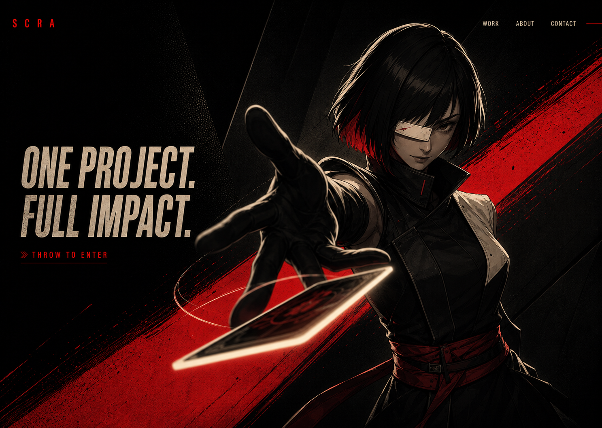
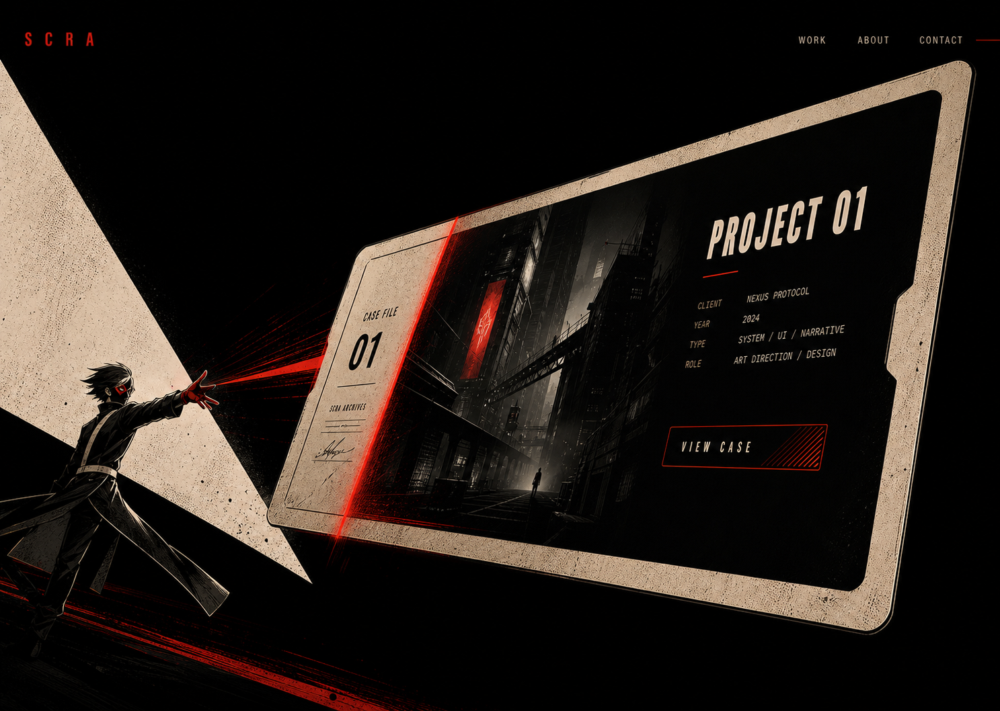
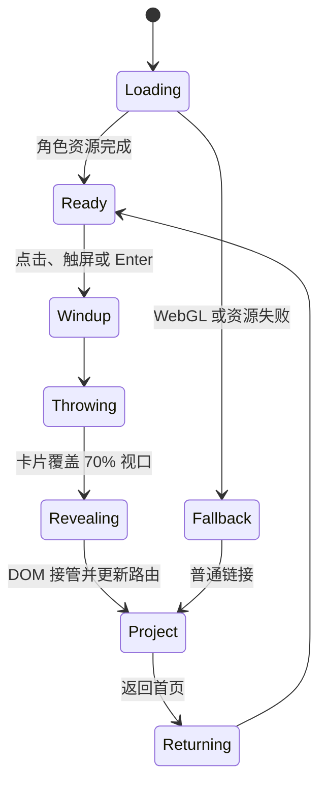

# Persona Hub 卡片投掷式作品站设计规格

- 日期：2026-07-27
- 状态：待用户最终审核
- 视觉方向：首页采用概念图 2，转场采用概念图 3
- 首轮范围：单个公开项目、原创角色、Three.js 卡片转场、项目案例页、About 与 Contact 基础入口

## 1. 决策摘要

网站主题确定为“被掷出的预告函”。

首页不是项目列表。一个原创怪盗式角色站在黑色舞台中，手中的唯一卡片代表当前唯一公开项目。用户触发主要操作后，角色将卡片投向镜头；卡片在三维空间中旋转、放大，内部沿绯红扫描线逐步显露项目页面，最终覆盖整个视口并成为真实的项目详情页。

这一方案合并了用户选择的两个方向：





概念图是艺术指导参考，不直接作为最终可交互界面的背景贴图。最终角色、卡片、文字和项目内容需要拆分为可控制的独立资产。

## 2. 用户结果

访问者应在十秒内得到三个信息：

1. 这是一个具有鲜明角色与电影感的个人作品站。
2. 当前只有一个重点项目，网站没有伪造数量。
3. 点击或触发卡片会真正进入项目，而不是播放无关片头。

核心成功标准是访问者记住“角色把项目卡投向我，卡片变成项目页”这一动作，同时能够无障碍地打开、阅读和返回项目。

## 3. 范围与非目标

### 首轮包含

- 桌面首页的原创角色、卡片和镜头场景。
- 角色待机、动作预备、投卡和动作收势动画。
- 卡片从 Three.js 场景过渡到 DOM 项目页面。
- 单个项目案例的正常纵向阅读结构。
- About 与 Contact 的轻量弹层或页面入口。
- 键盘、触屏、减少动态效果和 WebGL 降级路径。
- 桌面、中等性能移动端和低性能设备的三级质量策略。

### 首轮不包含

- 多项目轮播、假项目、空卡片或项目选择大厅。
- 实时布料、实时毛发、真实物理抛掷和可破坏场景。
- 全屏粒子雨、大量后处理通道或长时间滚动劫持。
- 自动播放音频。声音可在后续作为用户主动开启的增强层。
- 现成《女神异闻录 5》人物模型、服装、标志或界面资源。
- 将项目正文渲染进 Canvas。

## 4. 信息架构

```text
/
├── 首页主舞台
│   ├── SCRA 标识
│   ├── 主句：ONE PROJECT. FULL IMPACT.
│   ├── THROW TO ENTER 主操作
│   ├── WORK
│   ├── ABOUT
│   └── CONTACT
└── /work/[slug]
    ├── 项目首屏
    ├── 项目背景与目标
    ├── 角色与贡献
    ├── 关键过程
    ├── 结果与反思
    └── 返回首页
```

首页与项目页是两个真实路由。转场完成后再更新路由，确保直接访问 `/work/[slug]`、浏览器后退、刷新和分享链接都能正常工作。

## 5. 核心交互

### 5.1 首页加载

- DOM 标识、导航和主句优先渲染，不等待三维资源。
- 黑色舞台在首帧可见，避免白屏。
- 角色模型加载完成后以 240ms 的短交叉淡化进入。
- 首次访问播放一次 900ms 内的镜头稳定动作，随后进入待机。
- 返回首页时不重复完整开场，角色直接进入接卡后的稳定姿态。

### 5.2 待机状态

- 角色保持轻微呼吸、肩部移动和头发摆动，循环长度 6 至 8 秒。
- 鼠标移动只影响视线和上半身最多 3 度，不做持续追踪式大幅旋转。
- 卡片边缘每 4 至 6 秒出现一次弱浅色反光。
- 卡片和 “THROW TO ENTER” 都是同一个语义链接的可视触发区。

### 5.3 投卡触发

桌面端支持点击卡片、点击主操作和按 Enter。触屏端支持点击。滚轮不触发投卡，也不劫持页面；主要动作始终由明确控件发起。

重复输入在转场结束前被锁定，避免动画和路由重复执行。

### 5.4 项目阅读

项目页恢复普通浏览行为。红黑框架退到背景，真实项目截图和内容成为主角。案例章节不使用重复卡片网格，以全宽图像、窄文本列和少量结构化元数据组成线性叙事。

### 5.5 返回

项目页的返回按钮和浏览器后退都回到首页。完整设备播放简短逆向动作：项目页收缩为卡片，角色伸手接住。减少动态效果和低性能设备直接使用 160ms 交叉淡化。

## 6. 动画分镜

总转场目标时长为 1.15 秒。动作必须迅速，不能像不可跳过的片头。

| 时间 | 阶段 | 视觉动作 | 技术动作 |
| --- | --- | --- | --- |
| 0 至 120ms | 定格与预备 | 环境略微压暗，角色视线锁定镜头 | 锁定输入，预渲染项目 DOM |
| 120 至 320ms | 挥臂 | 肩、肘、腕依次发力，红色轨迹从手部产生 | 播放烘焙骨骼片段，卡片仍绑定手部骨骼 |
| 280 至 520ms | 释放 | 卡片脱手并以强透视旋转到画面中心 | 在指定动画事件解除骨骼绑定，切换到独立轨迹 |
| 420 至 760ms | 逼近镜头 | 卡片放大，角色退到左侧，背景细节压暗 | 镜头 FOV 轻微变化，降低角色渲染权重 |
| 680 至 980ms | 页面化 | 卡片内部沿绯红扫描线显露项目页面 | Canvas 卡面与已渲染 DOM 层同步交叉接管 |
| 920 至 1150ms | 落定 | 卡片边框超出视口，项目页面恢复正向平面 | 完成路由更新，暂停首页 Canvas |

缓动使用 quart、quint 或 expo 系列。禁止 bounce 和 elastic。最强速度变化发生在卡片离手到接近镜头之间，页面落定必须干净。

## 7. 卡片到页面的技术方案

项目页面从转场开始前就在 Canvas 后方以 DOM 渲染，只是被遮罩隐藏。Three.js 卡片承担离手、旋转和逼近镜头阶段。

当卡片覆盖约 70% 视口时：

1. 卡面使用项目首屏的轻量预览纹理，避免在 WebGL 内嵌真实网页。
2. DOM 项目层按照卡片投影方向使用 `clip-path` 揭示。
3. 一条绯红扫描线从卡片左侧移动到右侧，扫描线经过的位置由 WebGL 卡面切换为真实 DOM。
4. DOM 覆盖完整视口后，隐藏卡片网格并暂停首页 Canvas。
5. 路由状态更新为 `/work/[slug]`，焦点移动到项目主标题。

这种交接方式比把 HTML 绑定到三维卡面更稳定，也能保证项目正文清晰、可选择、可搜索和可访问。

## 8. 原创角色规格

角色沿用概念图 2 的核心轮廓：

- 中性偏女性的快递怪盗形象。
- 短黑色锐角波波头，内层一小段绯红。
- 单眼浅色几何护目片，不使用经典双眼怪盗面具。
- 黑色结构化无袖外套，一侧浅色肩片，腰部绯红束带。
- 修长手套和夸张手部透视是投卡动作的重点。
- 不使用斗篷、校服、枪械、塔罗符号或现成游戏徽记。

### 模型预算

- 角色主体：35,000 至 50,000 三角面。
- 骨骼：最多 70 根，包括手指、头发和外套辅助骨骼。
- 材质：主体不超过 3 个材质槽。
- 贴图：一套 2K Base Color，一套 2K Normal，一套 1K 合并 ORM。
- 动画：`idle`、`throw`、`recover` 三个烘焙片段。
- 卡片：单独网格和材质，静止时绑定手部挂点，释放后由运行时控制。
- 描边：优先使用单次可控描边方案，避免多层全屏后处理。

角色由 Blender 输出 GLB，使用 Meshopt 压缩和 KTX2 纹理。桌面角色包目标不超过 4.5MB。首轮原型在正式模型完成前可以使用简化占位模型验证动作，但不得把概念图裁成伪三维角色。

## 9. 视觉系统实施值

`DESIGN.md` 目前是预实现种子。第一轮代码使用以下候选值，并在浏览器对照概念图校准后写回正式设计系统：

```css
:root {
  --stage: oklch(0.08 0 0);
  --surface: oklch(0.14 0.01 25);
  --action: oklch(0.58 0.225 28);
  --action-deep: oklch(0.39 0.15 27);
  --print: oklch(0.93 0.012 78);
  --muted: oklch(0.68 0.018 60);
}
```

画面色彩占比以舞台黑约 75%、行动绯红约 15%、印刷浅色约 10% 为目标。绯红只表示动作和选择，不用于长段正文。

字体采用两套：

- 展示字：Barlow Condensed，700 与 800，用于主句和项目标题。
- 正文字：Source Sans 3，400 与 600，用于导航、按钮、元数据和正文。

首页展示字最大 96px，字距不小于 `-0.04em`。正文为 16px 至 18px，行长不超过 75 个字符。

## 10. 前端架构

项目采用现有环境指向的 Next.js 与 React 版本，新增依赖在实施计划中按实际锁文件确认。推荐使用 React Three Fiber 组织 Three.js 场景，GSAP 只负责跨 Canvas 与 DOM 的统一时间线。

```text
app/
├── page.tsx
├── work/
│   └── [slug]/
│       └── page.tsx
└── globals.css

components/
├── experience/
│   ├── ExperienceCanvas.tsx
│   ├── Character.tsx
│   ├── ProjectCard.tsx
│   ├── Stage.tsx
│   └── quality.ts
├── transition/
│   ├── TransitionProvider.tsx
│   ├── ProjectReveal.tsx
│   └── useCardTransition.ts
├── portfolio/
│   ├── ProjectCaseStudy.tsx
│   ├── AboutPanel.tsx
│   └── ContactPanel.tsx
└── ui/
    ├── SiteNav.tsx
    └── MotionPreference.tsx

content/
└── projects.ts

public/
├── models/
├── textures/
└── posters/
```

### 组件边界

- `ExperienceCanvas`：创建渲染器、镜头和质量档位，不知道路由内容。
- `Character`：加载角色模型、播放动画并暴露释放卡片事件。
- `ProjectCard`：管理卡片网格、轨迹和卡面纹理。
- `TransitionProvider`：持有全局转场状态机，协调 Three.js、DOM 和路由。
- `ProjectReveal`：管理扫描线与 DOM 遮罩，不操作角色骨骼。
- `ProjectCaseStudy`：只负责语义化项目内容和普通滚动。
- `quality.ts`：集中管理 DPR、后处理、帧率与降级条件，避免组件各自猜测设备。

### 状态机



状态机只允许单向进入当前阶段。页面隐藏、路由取消或资源失败时必须释放时间线和渲染循环。

## 11. 内容数据

首轮只有一个项目，但数据结构保持单记录可扩展，不在界面上暴露空列表。

```ts
type ProjectRecord = {
  slug: string
  title: string
  summary: string
  year: string
  roles: string[]
  heroImage: string
  sections: Array<{
    heading: string
    body: string
    media?: string[]
  }>
}
```

首页直接读取首个公开项目并生成卡面。未来增加项目时再设计选择机制，首轮不提前建设。

## 12. 性能预算

| 指标 | 桌面目标 | 移动目标 |
| --- | --- | --- |
| 首屏 DOM 可见 | 1.0 秒内 | 1.5 秒内 |
| LCP | 2.0 秒内 | 2.5 秒内 |
| 动画帧率 | 稳定 60fps | 稳定 30fps 以上 |
| GPU 帧时间 | 16.7ms 内 | 33ms 内 |
| DPR 上限 | 1.5 | 1.25 |
| 场景三角面 | 80,000 内 | 55,000 内 |
| Draw calls | 40 内 | 30 内 |
| 首屏角色 GLB | 4.5MB 内 | 2.8MB 内或降级 |
| 同时后处理通道 | 最多 1 个 | 0 个 |

### 自适应质量

- **Tier A**：桌面与高性能设备，完整角色、描边、轻量色彩后处理和 60fps。
- **Tier B**：现代移动设备，降低 DPR，关闭后处理，减少头发辅助骨骼更新，以 30fps 为目标。
- **Tier C**：WebGL 不可用、连续帧时间高于 32ms、低内存或减少动态效果设备，使用原创角色静态海报与轻量卡片过渡。

首屏运行两秒后采样平均帧时间。超过预算时依次降低 DPR、关闭后处理、降低动画更新频率；仍不达标才切换 Tier C。页面进入后台时暂停渲染，项目正文完全覆盖首页后停止 Canvas。

## 13. 响应式策略

### 1440px 以上

复现概念图 2 的完整构图。主句位于左侧，角色位于右侧偏中，手和卡片进入镜头中心。导航保持顶部水平布局。

### 768px 至 1439px

角色裁切到大腿以上，主句缩小到不超过 72px。卡片轨迹仍朝屏幕中心，About 与 Contact 改为全屏斜切面板。

### 767px 以下

角色改为胸像或半身构图，主句限制为两行。主要操作固定在安全触控区域，最小点击尺寸 44px。完整角色投掷只在 Tier B 设备启用；Tier C 使用静态角色与三维卡片，仍保留“卡片成为项目页”的核心叙事。

## 14. 可访问性

- Canvas 设置为装饰性层，不承载唯一信息。
- 主操作使用真实链接或按钮，支持 Enter、Space 与触屏。
- `prefers-reduced-motion: reduce` 下不播放角色投掷和镜头逼近，改为 160ms 交叉淡化。
- 转场完成后焦点移动到项目主标题；返回后恢复到首页主操作。
- 所有正文对比度至少 4.5:1，大型文字至少 3:1。
- 不依赖红色单独表达状态，同时使用位置、文字和焦点轮廓。
- 默认无声音；后续声音必须由用户主动开启并可随时关闭。
- 项目图片有具体替代文本，装饰纹理使用空替代文本。

## 15. 失败与恢复

- 角色模型加载失败：显示独立角色海报，主操作保持可点击。
- 项目卡面纹理失败：显示纯黑卡面和 `PROJECT 01` 文本。
- WebGL 初始化失败：跳过 Canvas，保留普通项目链接。
- 转场中路由失败：撤销遮罩，恢复首页交互并显示简短错误信息。
- 用户在转场中切换标签页：回到页面时直接完成到项目页，避免动画卡在中间。
- 浏览器后退：根据当前路由恢复对应稳定状态，不重放不完整时间线。

## 16. 验证方式

根据项目规则，本阶段不创建单元测试。首轮实现完成后执行以下人工与工具化验证；若需要新增自动化或单元测试，将先征得用户同意。

### 视觉验证

- 在 1440×1024 视口对照概念图 2 检查角色位置、主句尺度、黑红浅色比例和卡片透视。
- 截取转场 70% 进度，对照概念图 3 检查卡片到 DOM 的交接是否像同一物体。
- 检查 1024px、768px、390px 三个关键宽度，确保文字无溢出、角色不遮挡主操作。

### 行为验证

- 点击、Enter 和触屏均只触发一次转场；滚轮不会触发或劫持转场。
- 直接打开项目路由、刷新、浏览器后退和返回按钮均正确。
- 减少动态效果、WebGL 失败和模型失败时仍能进入项目。
- 转场中快速重复输入不会产生双路由或卡死状态。

### 性能验证

- 记录桌面和移动档位的平均帧时间、DPR、三角面、Draw calls 与 GLB 体积。
- 验证 Canvas 在标签页隐藏、项目页面覆盖和组件卸载时停止渲染。
- 检查长任务、布局抖动和不必要的全屏后处理。

## 17. 实施顺序

1. 建立静态 DOM 首页、项目路由、内容结构和无动画降级路径。
2. 建立 Three.js 舞台、卡片网格、镜头和转场状态机。
3. 使用简化模型验证投卡时间线与 DOM 扫描接管。
4. 接入正式 Blender 角色、烘焙动作、压缩贴图和质量档位。
5. 完成项目页面、返回动作、About、Contact 与响应式布局。
6. 进行视觉对照、性能预算和可访问性验收。

第一轮开发应先证明“角色投卡，卡片变页面”成立，再增加材质细节。任何不能强化这条因果链的效果不进入首轮。

## 18. 验收标准

- 首页视觉明确采用概念图 2 的角色与构图方向。
- 卡片转场明确采用概念图 3 的页面化逻辑。
- 用户从主要操作到可阅读项目页不超过 1.15 秒。
- 首页不存在项目轮播、随机三维物体或多余卡片。
- 项目正文为真实 DOM，支持选择、搜索、键盘和直接链接。
- 桌面保持 60fps 目标，现代移动端保持 30fps 以上，低性能设备自动降级。
- 减少动态效果与 WebGL 失败时仍能完整访问项目。
- 角色设计保持原创，不依赖现成游戏角色资产。
- 所有主要路由与导航在无动画条件下也能成立。
